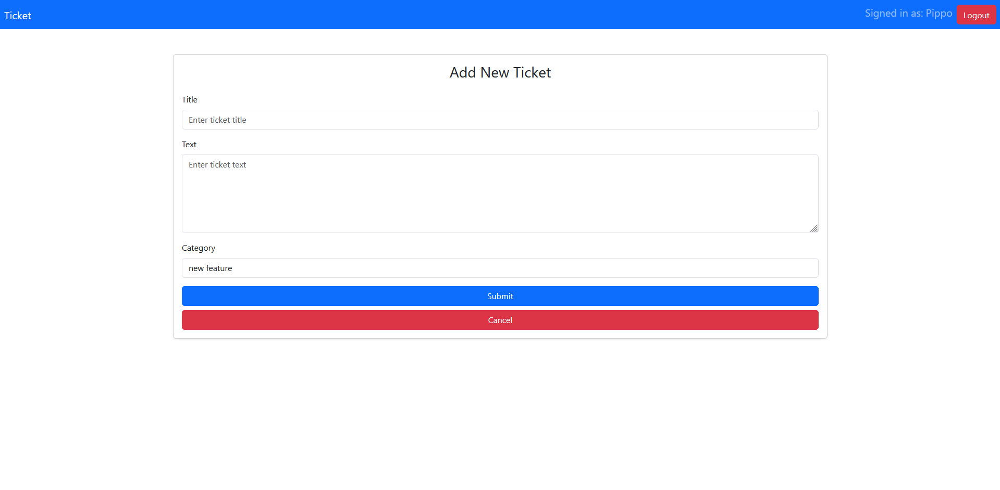

[](https://classroom.github.com/a/Y8bW3OQP)
# Exam #1: "Ticketing system"
## Student: s331461 Nobili Luca 

## React Client Application Routes

- Route `/`: main page with header and tickets for authenticated and unauthenticated users.
- Route `/add/`: page for adding new Ticket.
- Route `/add/confirm`: page for confirm the submsission of a new Ticket.
- Route `/login`: Login form, allows users to login. 

## API Server

* **GET '/api/def'**: Get the information of all the tickets for both authenticated and unauthenticated users:
  - reponse body: JSON
    ```
    [ { "id": 1 , "timestamp": "2024-06-30 12:05:31", "title": "Need money?", "category" : "administrative", "state" : 1 , "idOwner" : 5, "name" : "Nicola}, ... ]
    ```
  - codes: 200 ok, 500 Internal Server Error.


* **GET '/api/ticket/:id'**: Get the information about the blocks of each ticket:
  - requesst parameter: 'id' : Ticket Id
  - reponse body: JSON
    ```
    [  {  "text" : "intialize your variables!!", "timestamp" : "2023-03-10 17:32:00", "author" : "Pluto" }, ...  ]

    ```
  - codes: 200 ok, 401 Unauthorized, 404 Not Found, 500 Internal Server Error.

* **GET '/api/ticket/text/:id'**: Get the text (descryption) of a ticket:
  - requesst parameter: 'id' : Ticket Id
  - reponse body: JSON 
    ```
    {  "text" : "I want to buy a Ferrari" }

    ```
  - codes: 200 ok, 401 Unauthorized, 404 Not Found, 500 Internal Server Error.

* **GET '/api/categories'**: Get the categories
  - reponse body: JSON 
    ```
    [{ "Category": "inquiry" } , ...]
    ```
  - codes: 200 ok, 500 Internal Server Error.

* **PUT '/api/state/user/:id'**: Set the state of a ticket as Closed, used with noraml user
  - request parameter: 'id' : Ticket Id
  - response body content: 
    ```
    {"state" : 'success' , 'id' : 1}
    ```
  - codes: 200 OK, 401 Unauthorized, 404 Not Found, 500 Internal Server Error.

* **PUT '/api/state/admin/:id'**: Set the state of a ticket as Closed / open, used with admin user
  - request parameter: 'id' : Ticket Id
  - request body: 
    ```
    { 'value' : true }
    ```
  - response body content: 
    ```
    { "state" : 'success' , 'id' : 1 }
    ```
  - codes: 200 OK, 401 Unauthorized, 404 Not Found, 500 Internal Server Error.

* **PUT '/api/category/:id'**: Change the category, allowed if the user is an Admin
  - request parameter: 'id' : Ticket Id
  - request body:
    ```
     { 'value' : 'inquiry' }
    ```
  - response body content: 
  ```
    { "state" : 'success', 'category' : 'inquiry' }
  ```
  - codes: 200 OK, 401 Unauthorized, 404 Not Found, 500 Internal Server Error.

* **POST '/api/newTickets'**: Create new Ticket.
  - request body: 
    ```
     {
        state: 1,
        category: "inquiry ",
        idOwner: 1,
        title: " ... ",
        timestamp: "2023-03-10 17:32:00"
        text: "..."
    }
    ```
  - response body content: 
  ```
    { "id" : 9 }
  ```
  - codes: 200 OK, 401 Unauthorized, 404 Not Found, 500 Internal Server Error.

* **POST '/api/newBlock'**: Create new Block.
  - request body: 
    ```
     {
        idticket: 1,
        authorId: 2 ,
        timestamp:  "2023-03-10 17:32:00",
        text: "... "
      }
    ```
  - response body content: 
  ```
    { "id" : 10 }
  ```
  - codes: 200 OK, 401 Unauthorized, 404 Not Found, 500 Internal Server Error.

### Authentication APIs

* **POST '/api/sessions'**: Authenticate and login the user.
  - Request JSON object
    ```
    { "username": "pippo@email.it", "password": "pwd" }
    ```
  - Response body JSON  
    ```
    { "id": 1 , "name": "Pippo",
      "username": "pippo@email.it",
      "admin": 1 }
    ```
  - Codes: 200 OK, 401 Unauthorized (incorrect email and/or password), 400 Bad Request (invalid request body), 500 Internal Server Error.


* **DELETE '/api/session'**: Logout the user.
  - Codes: `200 OK`, `401 Unauthorized`.

* **GET '/api/sessions/current'**: check whether the user is logged in or not.
  - Codes: `200 OK`, `401 Unauthorized`, `500 Internal Server Error`.
  

## API Server2

* **POST  '/api/estimation'**: get the estimation, provide different value if the user is admin (hours) or normal (days)
  - request : JSON object:
  ```
    { "category": "administrative" , "title": "How to write a program in Python?" }
  ```
  - response body content:
  ```
    {estimation: hour / day }
  ```
  - Codes: `200 OK`, `401 Unauthorized`, `400 Bad Request`.

## Database Tables

- Table `Users` - 
  - id: An integer that uniquely identifies each user. It is the primary key and is auto-incremented.
  - email: A text field that stores the email address of the user.
  - name: A text field that stores the name of the user
  - password: A text field that stores the hashed password of the user. 
  - salt: A text field that stores the salt used for hashing the user's password.
  - admin: A boolean field that indicates whether the user has administrative privileges.
- Table `Tickets` 
  - id: An integer that uniquely identifies each ticket. It is the primary key and is auto-incremented.
  - state: A boolean field that indicates the state of the ticket (open or closed).
  - category: A text field that stores the category of the ticket. 
  - idOwner: An integer that stores the ID of the user who owns the ticket. 
  - title: A text field that stores the title of the ticket. 
  - timestamp: A text field that stores the timestamp when the ticket was created.
  - text: A text field that stores the detailed description of the ticket. 
- Table `Blocks`
  - id: An integer that uniquely identifies each block. It is the primary key and is auto-incremented.
  - text: A text field that stores the block's text. 
  - authorId: An integer that stores the ID of the user who authored the block.
  - timestamp: A text field that stores the timestamp when the block was created. 
  - idticket: An integer that stores the ID of the ticket associated with the block. 
- Table `Categories`
  - name: A text field that stores the name of each category.

## Main React Components

*  `MyHeader` :
    This component represents the application's header. It displays the application name, the user's name if logged in, and a logout or login button based on the authentication state.

*  `Layout` :
    This component defines the overall layout of the application. It includes the header (MyHeader) and a container for the dynamic page content (Outlet).

*  `LoadingSpinner` :
  This component shows a loading animation while data is being fetched from the API.

*  `TicketRoute` :
    This component (imported from TicketComponents.jsx) handles the display and operations on tickets. It includes specific logic to display tickets based on the user's role (admin or not) and the tickets' state (open or closed).

*  `FormAdd` :
    This component (imported from AddComponent.jsx) provides a form for adding new tickets. It manages the form state and the available categories for selection.

*  `ConfirmAdd` :
    This component (imported from AddComponent.jsx) shows a confirmation page before a ticket has been successfully added, where title, cateogory and descryption are shown. It also handles the final submission of the ticket to the API.

*  `LoginForm` :
    This component (imported from AuthComponents.jsx) provides a login form for the user. It handles authentication and updates the application's state once the user is successfully logged in.


## Screenshot





## Users Credentials

| email | password | name | role |
|-------|----------|------|-------------|
| pippo@email.it | pwd | Pippo | admin |
| pluto@email.it | pwd | Pluto | user |
| cosimino@email.it | pwd | Cosimino | user |
| luca@email.it | pwd | Luca | admin |
| nicola@email.it | pwd | Nicola | user |
